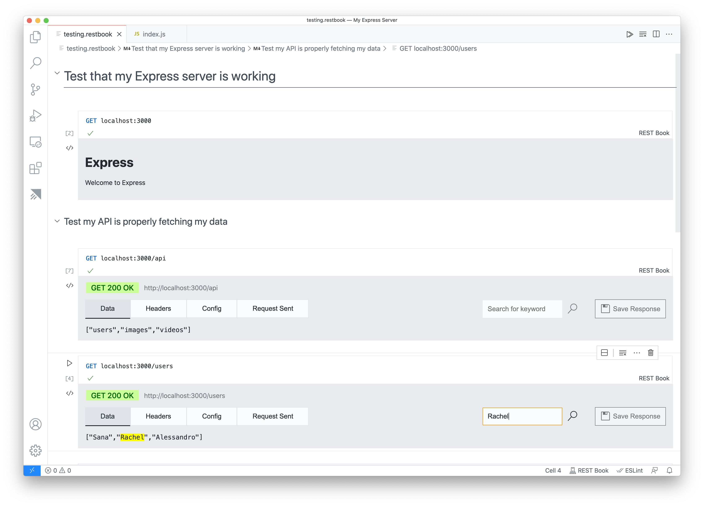
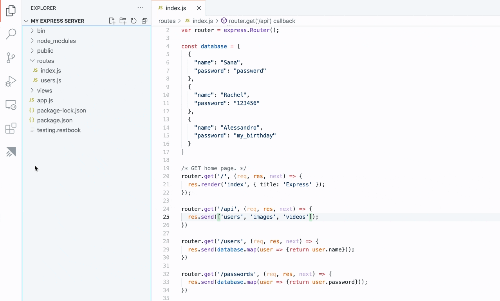
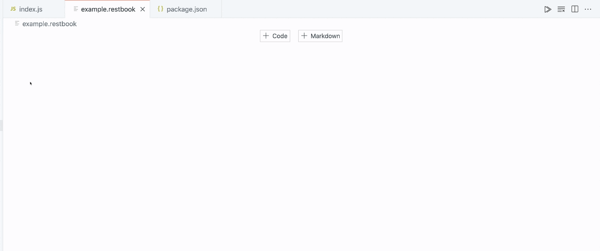
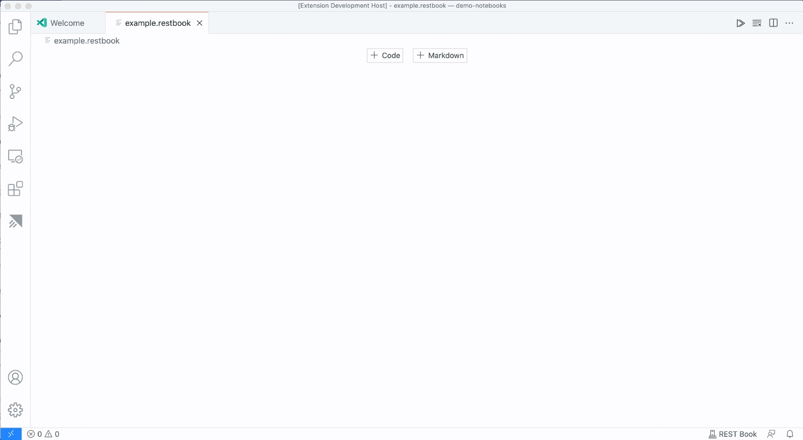

👉👉👉 This extension is still under development.

👉👉👉 Latest VS Code Insiders is required and at times this extension might be broken.

# REST Book

REST Book is a Visual Studio Code extension that allows you to perform REST calls in a Notebook interface.



## Features

- Create and run REST Calls within cells.
- Organize multiple REST Calls within one file.
- Intermingle markdown for documenting your calls.
- View rich HTML and image responses directly inside the Notebook.
- Basic Authentication
- Use data from one call in the next

## Requirements

Must be using the latest version of Visual Studio Code Insiders edition.

## Usage

1. Create a new file to store your REST Calls with a `.restbook` ending.

1. Add an code cell by hovering over the middle of the Notebook and clicking the `+ Code`
1. Add your intended URL as the first line of the cell. By default without specifying a method, it will be a GET call.



### More examples

```javascript
google.com
```

is equivalent to:

```javascript
GET google.com
```

In subsequent lines immediately following the first line add any parameters or queries starting with `?` or `&` like this:

```javascript
GET https://www.google.com
    ?query="fun"
    &page=2
```

In the lines following without an empty line will be considered as the Request Headers:

```javascript
GET https://www.google.com
    ?query="fun"
    &page=2
User-Agent: rest-book
Content-Type: application/json 
```

The last lines after a new line separator is the body of the call. Like the following:

```javascript
POST https://www.myapi.com
User-Agent: rest-book
Content-Type: application/json 

{
    name: "Foo",
    text: "Foo is the most bar of the Foos" 
}
```

You can also assign the responses from calls to a variable and use the data from that response in future calls. To do this you would just declare a variable with `let ` and the name of your variable and then a `=` like so:

```javascript
let foo = GET google.com
```

And then in future cells you can reference `foo` in the body of your calls. Here's a short example:


To test these interactions, you can play around with this simple server: [SandboxServer](https://github.com/tanhakabir/SandboxServer)

## Known Issues

Unable to save responses. This should be fixed soon in the next few versions of VS Code Insiders.

## Any Other issues

Please submit your issue on the [tanhakabir/rest-book](https://github.com/tanhakabir/rest-book) repository with exact reproduction steps.
